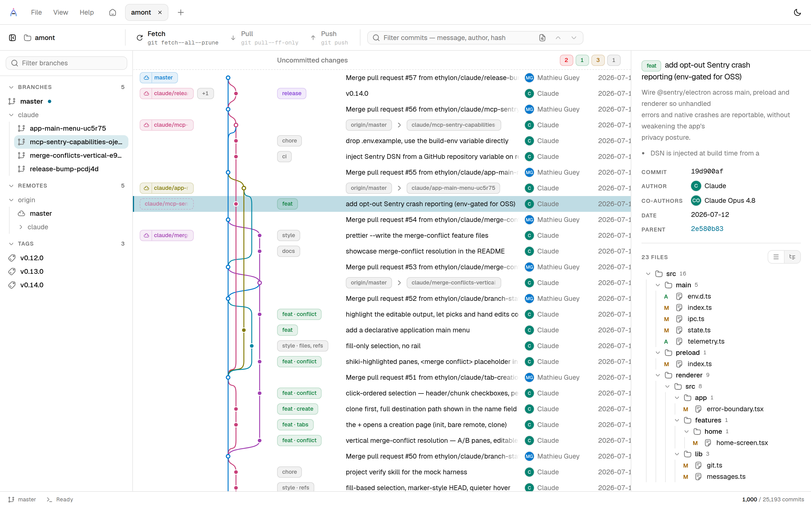
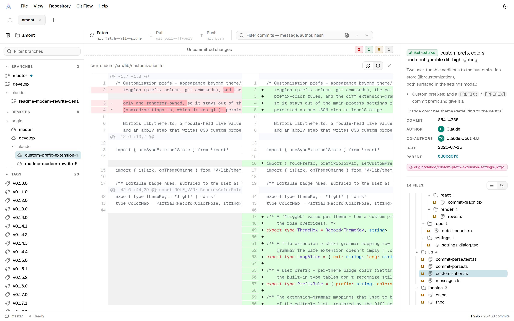
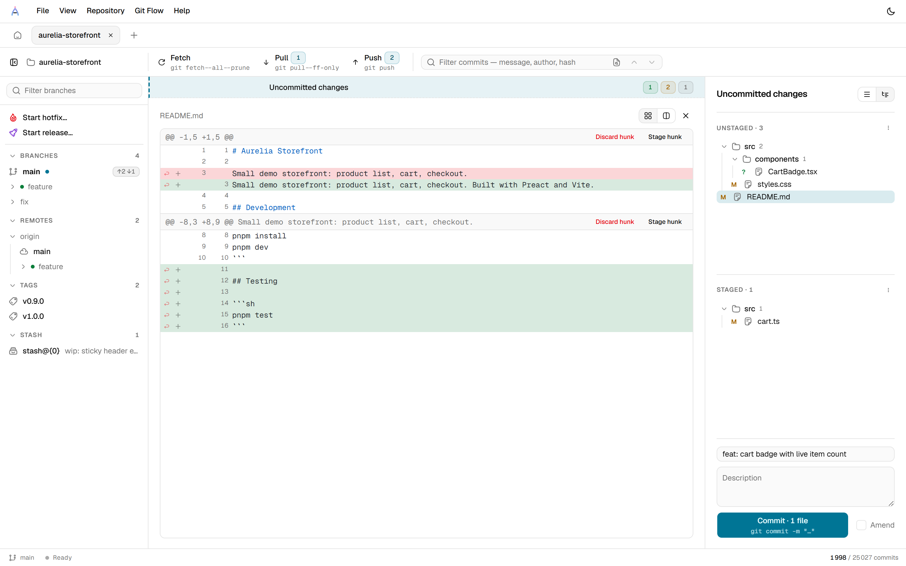
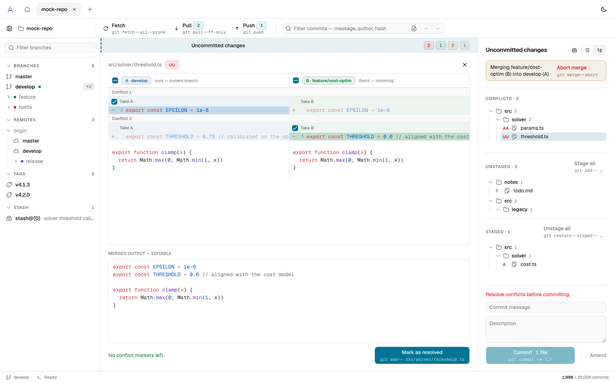
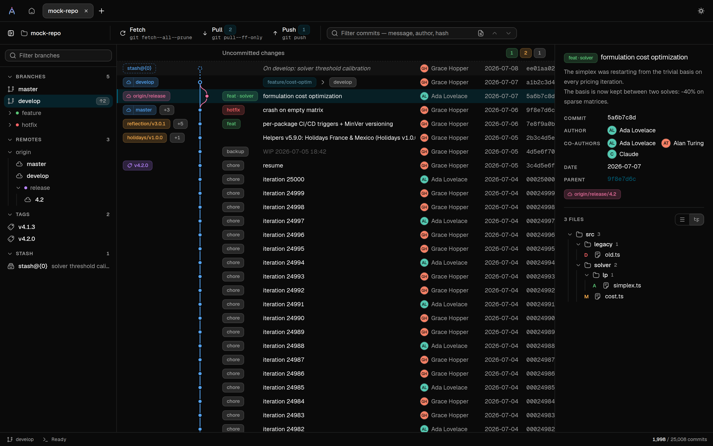

<div align="center">


# Amont

**A fast, keyboard-friendly Git history visualizer for Windows.**

[](LICENSE)


</div>

Amont renders a repository's commit history as a metro-map-style graph: branches as
lanes, merges as curves, refs as chips. It's built for repositories with tens to hundreds
of thousands of commits — the graph engine pages and virtualizes both the layout and the
DOM instead of rendering everything up front.



## Built for big histories

The graph above is a 25,000-commit repository — Amont scrolls it without loading it. Only
the visible window of commits is laid out and mounted; pages are fetched as you scroll,
evicted when you leave, and refetched on return, so a long-distance jump (search hit,
ref click) lands instantly. Branch lanes, merge curves, tags, and stash entries are all
folded into one timeline, and selecting a commit opens its full message, co-authors,
and changed files in the detail panel.

## Diffs that read like code

Diffs are syntax-highlighted (Shiki, same grammars as VS Code) and render unified or
side-by-side, for a single file or a whole commit. The two panes scroll together.



## Stage and commit without leaving the graph

The `Uncommitted changes` row at the top of the graph opens the staging panel: stage or
unstage files (or everything at once), review each change in a live diff, and commit or
amend — with the exact git command shown on the button before you run it.



## Resolve merge conflicts side by side

When a merge, rebase, or stash pop leaves conflicts, the conflicted files get their own
block in the staging panel and a banner naming both sides — **A** is the branch you're on
(_ours_), **B** the one being merged in (_theirs_). Opening a file lays the two versions out
in aligned, syntax-highlighted panes so it's always clear which change came from where.

You build the resolution by picking: a checkbox in each pane header takes a whole side across
every conflict, a per-chunk checkbox takes one side of one conflict, and per-line `+`/`−`
buttons take individual lines. Lines land in the merged output **in the order you click
them** — no forced A-before-B — and each carries its position so that order stays visible.
The output is a normal, syntax-highlighted editor: picks and hand edits coexist, so you can
fine-tune the result and still keep clicking. `Mark as resolved` writes the file and stages
it once no conflict markers remain.



## And more

- **git-flow aware** — feature/release/hotfix branches get a context banner and a
  one-click finish.
- **Full-text commit search** — message, author, hash, optionally diff content.
- **A read-only git console** — every command the app runs is traced, for transparency.
- **Keyboard-first** — the graph, file lists, and popovers are all operable without a
  mouse.
- **Light and dark** — follows the OS, or pick one. Here's the graph again, in dark:



> Screenshots show the built-in demo harness (`pnpm mock`) — a synthetic repository of
> ~25k commits.

## Install

Download the latest installer from the [Releases](https://github.com/ethylon/amont/releases)
page and run it. There's no auto-update yet — check the releases page for new versions.

**Platform**: Windows only for 1.0. The codebase has no macOS/Linux packaging target or
platform-specific lifecycle handling (app menu, `activate`, etc.) yet.

**About the SmartScreen warning**: released binaries are not code-signed. Windows will
show an "unknown publisher" warning (SmartScreen) when you run the installer — this is
expected, not a sign of tampering. See [CONTRIBUTING.md](CONTRIBUTING.md) for the signing
plan.

## Privacy

Author avatars resolve either from the author's email if it's a GitHub noreply address (no
network request), or by querying Gravatar / `avatars.githubusercontent.com` directly — which
reveals the (hashed) author email and your IP address to those services. An author without an
avatar there falls back to a colored monogram.

**Crash reporting.** Official release builds report unhandled errors and native crashes to
Sentry, so bugs surface and get fixed. Reports carry no repository contents, diffs, or
credentials, and no PII (IP, hostname, user identity) — see `src/main/telemetry.ts`. It's
**opt-out at runtime** from a toggle on the home screen. Builds from source send nothing: the
DSN is injected at build time from a build-env variable that only CI sets, so a build you make
yourself has no telemetry at all. Reports leave from the main process, never the sandboxed
renderer, so the renderer's strict CSP is unchanged.

## Development

Requires Node (see `.nvmrc` / `engines.node` in `package.json`) and [pnpm](https://pnpm.io).

```sh
pnpm install
pnpm dev      # run the real Electron app
pnpm mock     # browser-only harness: real UI, simulated git backend, ~25k synthetic commits
pnpm test     # vitest
pnpm build    # electron-vite build (main + preload + renderer)
pnpm typecheck
```

`pnpm mock` is the fastest inner loop for UI work: it boots the real renderer in a plain
browser tab against a fake `window.amont` bridge (see `src/renderer/mock.html`), so you get
instant reload without packaging or spawning git processes.

### Crash reporting (maintainers)

Error reporting is inert unless a Sentry DSN is baked in at build time, via the
`MAIN_VITE_SENTRY_DSN` build-env variable (electron-vite reads it straight from the build
environment — no file involved). Every build without it — including every build from source,
`pnpm dev`, and CI on ordinary commits — sends nothing.

- **Official releases (CI):** set a `SENTRY_DSN` **repository variable**; the release workflow
  maps it into the build (`.github/workflows/release.yml`). A DSN is embedded in the shipped
  binary, so it's not confidential — a variable, not a secret (a secret works too, just swap
  `vars.` for `secrets.`).
- **Local testing:** prefix the command, e.g. `MAIN_VITE_SENTRY_DSN=<dsn> pnpm dev`.

See the [Privacy](#privacy) section for what's reported and `src/main/telemetry.ts` for how.

## Contributing

See [CONTRIBUTING.md](CONTRIBUTING.md) for project conventions and the release process.

## Security

See [SECURITY.md](SECURITY.md) for the app's trust boundaries and how to report a
vulnerability.

## License

[MIT](LICENSE)
