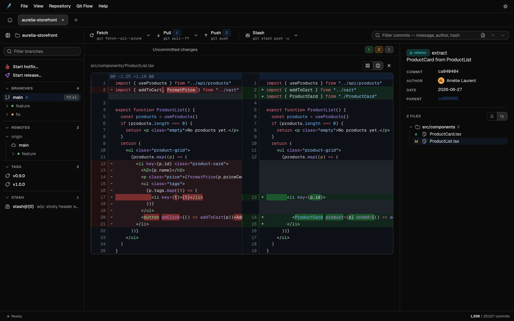
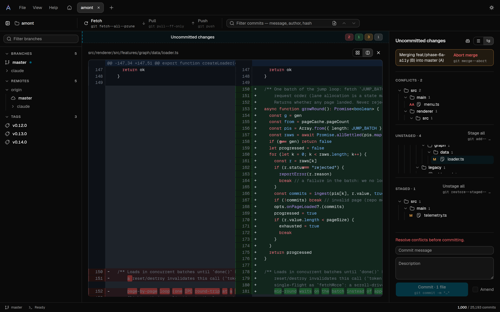
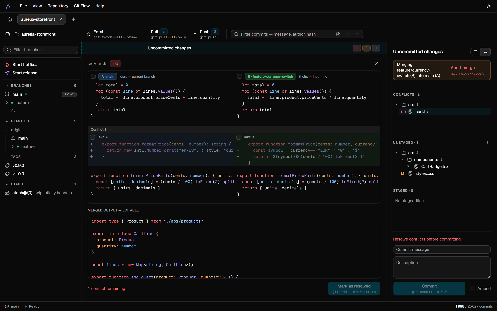

<div align="center">


# Amont

### A fast, keyboard-friendly Git client for Windows.

[](https://github.com/ethylon/amont/releases/latest)
[](https://github.com/ethylon/amont/actions/workflows/ci.yml)
[](LICENSE)


**[⬇ Download the latest release](https://github.com/ethylon/amont/releases/latest)** ·
[Features](#features) · [Screenshots](#screenshots) · [Install](#install) · [Development](#development)


</div>

Amont displays a repository's history as a commit graph and lets you work directly from
it: search commits, read diffs, stage changes, commit, resolve merge conflicts, and manage
branches, worktrees and remotes. It runs the `git` installed on your machine and shows
every command it executes.

## Features

- **Commit graph** — branches, merges, tags, stashes and ahead/behind status in one
  scrollable view; commit subjects carry type badges (`feat`, `fix`, …). The graph stays
  fast on very large histories (100,000+ commits).
- **Commit search** — by message, author or hash prefix; can also search the contents of
  diffs.
- **Diffs** — syntax-highlighted, unified or side-by-side, per file or for the whole
  commit. Images are shown in an image viewer.
- **Staging** — stage, unstage or discard files, folders, hunks or single lines from an
  interactive diff. Commit and amend from the same panel.
- **Merge conflicts** — both versions side by side; take a whole side, one block or
  single lines, in any order, then edit the merged result freely before marking the file
  resolved.
- **Worktrees** — create, open, reveal or remove linked worktrees from the sidebar or the
  graph.
- **git-flow** — start, publish and finish feature, release and hotfix branches from the
  UI.
- **Remote operations** — fetch, pull and push with live progress; optional periodic
  auto-fetch (with prune) keeps the graph up to date.
- **Command transparency** — mutation buttons show the exact git command they will run,
  and a read-only console logs every command the app executes.
- **Repository maintenance** — a healthcheck runs `fsck` and `gc`, reports object counts,
  and finds stranded pack files and stale temporary files.
- **Keyboard support** — the graph, file lists, sidebar, menus and popovers all work
  without a mouse.
- **Customization** — light and dark themes, English and French UI (switchable at
  runtime), custom branch-prefix colors, configurable diff highlighting.
- **Auto-update** — checks GitHub Releases at startup, downloads in the background, and
  installs on quit or on _Restart now_.
- **Sandboxed UI** — the interface runs in Chromium's sandbox with a strict CSP; only the
  main process accesses git, the disk and the network.

## Screenshots

All screenshots show Amont on this repository's own history.

### The commit graph

Branch lanes, merge curves, tags, stashes and ahead/behind status in a single timeline —
here a history of about 25,000 commits. Selecting a commit opens its full message,
co-authors and changed files in the detail panel.


### Diffs

Unified or side-by-side, one file or the whole commit, with syntax highlighting
throughout. The two panes scroll together; images are shown in an image viewer.


<details>
<summary>Same view, dark theme</summary>



</details>

### Staging

The `Uncommitted changes` row at the top of the graph opens the staging panel: stage or
unstage files, folders, hunks or single lines from a live diff, then commit or amend. The
commit button shows the exact git command before you run it.


<details>
<summary>Same view, dark theme</summary>



</details>

### Merge conflicts

When a merge, rebase or stash pop leaves conflicts, opening a conflicted file lays both
versions out in aligned, syntax-highlighted panes — **A** is the branch you're on
(_ours_), **B** the one being merged in (_theirs_). A checkbox per pane takes a whole
side, a per-chunk checkbox takes one side of one conflict, and per-line `+`/`−` buttons
take single lines, in the order you click them. The merged output is a regular editor, so
picks and hand edits can be combined; `Mark as resolved` writes the file and stages it
once no conflict markers remain.


<details>
<summary>Same view, dark theme</summary>



</details>

## Install

**[Download the installer from the latest release](https://github.com/ethylon/amont/releases/latest)**
and run it. Amont then keeps itself up to date: it checks GitHub Releases at startup,
downloads updates in the background, and installs them on quit or when you click
_Restart now_.

Amont uses the `git` installed on your machine.

**Platform.** Windows only for now; macOS and Linux builds are not available yet.

**SmartScreen warning.** Released binaries are not code-signed yet, so Windows shows an
"unknown publisher" warning when you run the installer. This is expected. Update
integrity relies on HTTPS to GitHub plus the `sha512` checksum in `latest.yml`; see
[CONTRIBUTING.md](CONTRIBUTING.md) for the signing plan.

## Privacy

**Author avatars.** For authors using a GitHub noreply address, the avatar is derived
from the email without any network request. Otherwise Amont queries Gravatar /
`avatars.githubusercontent.com`, which reveals the hashed author email and your IP
address to those services. Authors without an avatar there get a colored monogram.

**Crash reporting.** Official release builds report unhandled errors and native crashes
to Sentry. Reports contain no repository contents, diffs or credentials, and no PII (IP,
hostname, user identity) — see `src/main/telemetry.ts`. Reporting can be turned off from
a toggle on the home screen. Builds from source send nothing: the Sentry DSN is injected
at build time and only CI sets it. Reports are sent by the main process, never the
sandboxed renderer.

## Development

Requires Node (see `.nvmrc` / `engines.node` in `package.json`) and [pnpm](https://pnpm.io).

```sh
pnpm install
pnpm dev      # run the Electron app
pnpm mock     # browser-only harness: real UI against a simulated git backend
pnpm test     # vitest
pnpm build    # electron-vite build (main + preload + renderer)
pnpm typecheck
```

`pnpm mock` runs the renderer in a plain browser tab against a fake `window.amont` bridge
(see `src/renderer/mock.html`) with a ~25,000-commit synthetic dataset — the fastest
inner loop for UI work, with instant reload and no git processes. The screenshot harness
at `/screenshots.html` uses the same setup with a dataset generated from this
repository's history; the README and site screenshots come from it.

The graph engine's performance budget and measurements live in
[`docs/performance-audit.md`](docs/performance-audit.md).

### Crash reporting (maintainers)

Error reporting is inert unless a Sentry DSN is provided at build time via the
`MAIN_VITE_SENTRY_DSN` build-env variable (electron-vite reads it from the build
environment — no file involved). Builds without it — including builds from source,
`pnpm dev`, and CI on ordinary commits — send nothing.

- **Official releases (CI):** set a `SENTRY_DSN` **repository variable**; the release
  workflow maps it into the build (`.github/workflows/release.yml`). The DSN ends up in
  the shipped binary, so it's not confidential — a variable, not a secret (a secret works
  too, just swap `vars.` for `secrets.`).
- **Local testing:** prefix the command, e.g. `MAIN_VITE_SENTRY_DSN=<dsn> pnpm dev`.

See [Privacy](#privacy) for what reports contain and `src/main/telemetry.ts` for the
implementation.

## Contributing

Issues and pull requests are welcome — see [CONTRIBUTING.md](CONTRIBUTING.md) for project
conventions and the release process, and [SECURITY.md](SECURITY.md) for the app's trust
boundaries and how to report a vulnerability.

## License

[MIT](LICENSE) © Mathieu Guey
